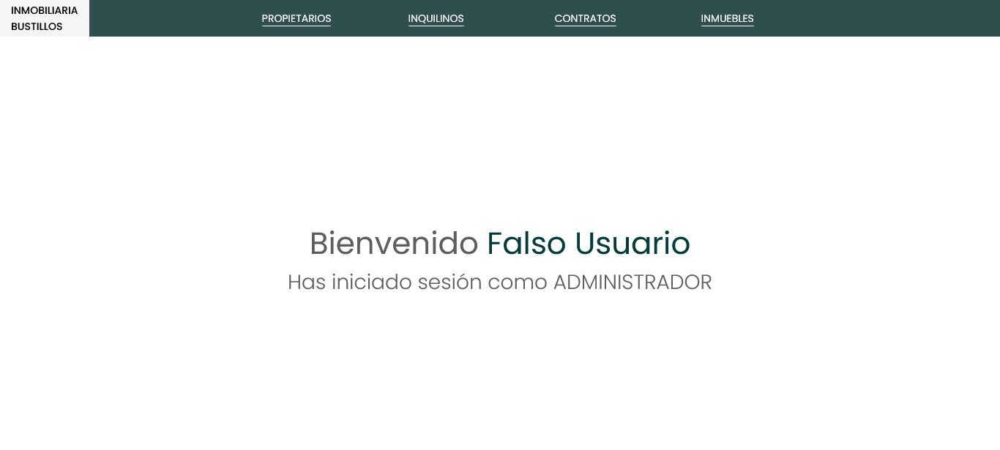
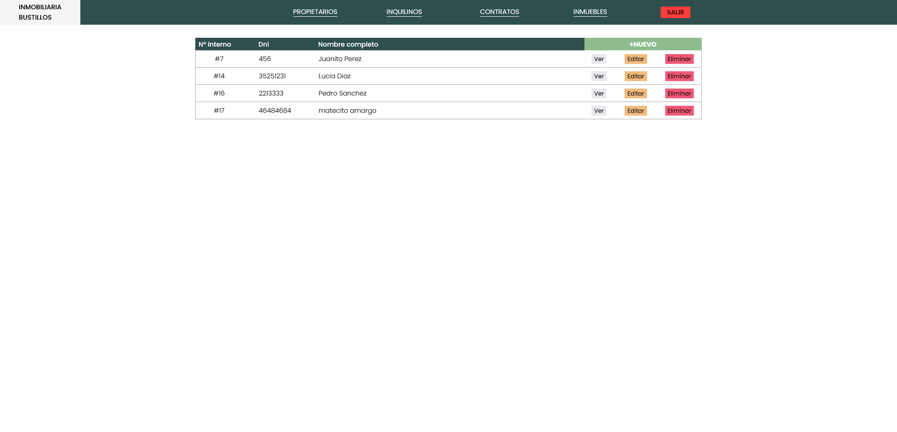
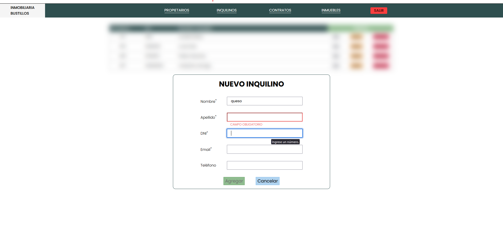
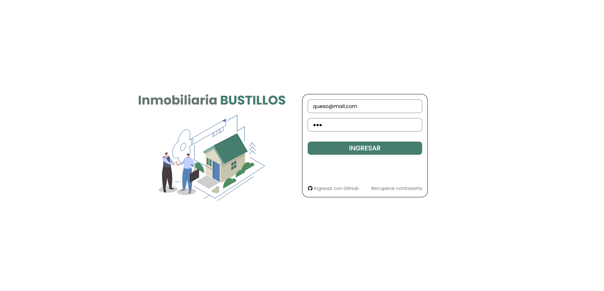

# Sistema de Inmobiliaria

## Primer entregable

- ABM de inquilinos y propietarios
- Esquema DB

## Herramientas

En la carpeta scripts se encuentra los scripts para crear la BD y las tablas.

## PREVIEW Primer entregable

### Home

### Pantalla propietarios

### Pantalla agregar propietarios

## Segundo entregable

- ABM de propiedades y contratos
- Esquema DB actualizado

## PREVIEW Segundo entregable

### Login

